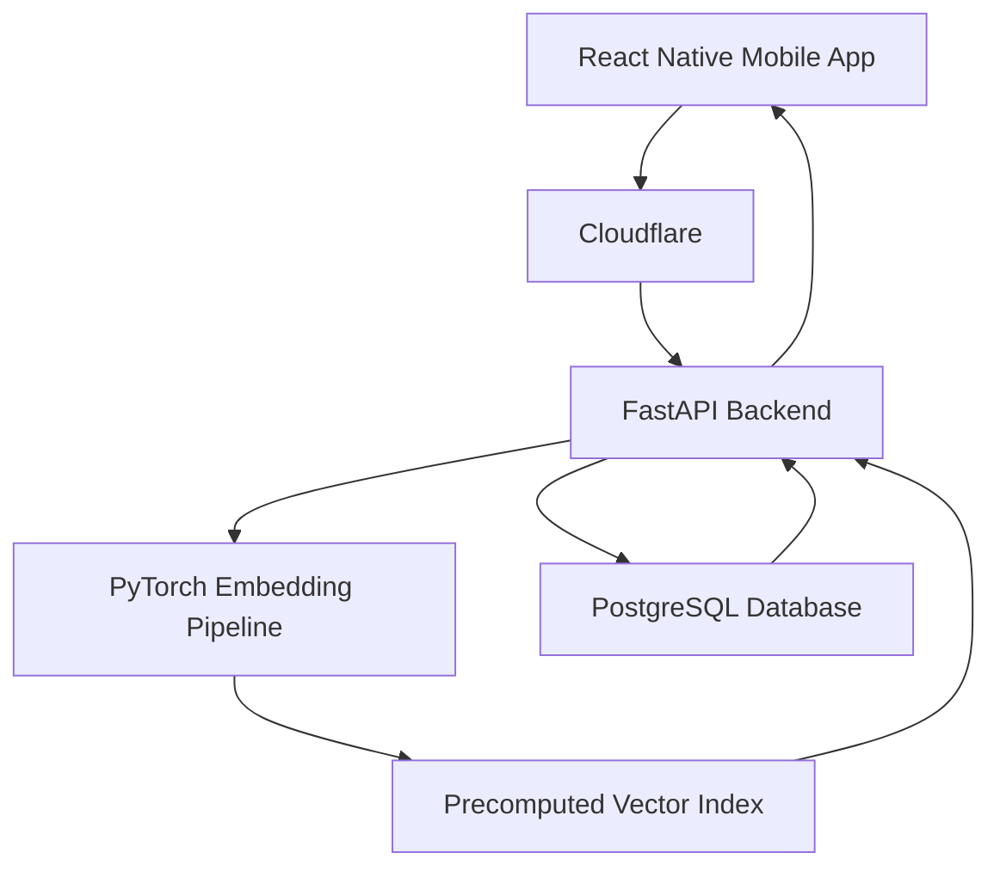

# GreenPeaks - AI Plant Identifier

GreenPeaks is an AI-powered plant-identification platform that allows users to submit a plant image and receive ranked identification results backed by a large plant dataset.

The production application combines a React Native mobile interface, a FastAPI backend, PostgreSQL data storage, a PyTorch image-embedding pipeline, Docker-based deployment, and Cloudflare infrastructure.

> This repository is a public technical case study. The production source code, model artifacts, credentials, infrastructure configuration, and private application data are maintained in a separate private repository.

## Project Overview

GreenPeaks was built to make plant identification faster and more accessible while providing an architecture capable of supporting a large image dataset and production users.

The platform processes an uploaded image, generates a numerical embedding, compares that representation against a precomputed plant-image index, and returns the most similar plant records to the mobile application.

### Key Capabilities

* Image-based plant identification
* Ranked similarity results
* Plant information retrieval
* Mobile interface built with React Native
* REST API developed with FastAPI
* PostgreSQL-backed plant data
* PyTorch-based image processing and inference
* Precomputed vector embeddings for efficient similarity search
* Dockerized backend deployment
* Cloudflare-protected API infrastructure

## Architecture

### Mobile Application

The React Native application provides the user-facing interface for submitting images and reviewing identification results. It communicates with the backend through REST API requests and presents ranked plant matches returned by the inference pipeline.

### Backend API

The FastAPI backend coordinates image processing, model inference, similarity matching, and plant-data retrieval. API endpoints connect the mobile client to the machine-learning pipeline and PostgreSQL database.

### Machine-Learning Pipeline

The identification system uses a vision-transformer-based embedding pipeline implemented with PyTorch. Instead of comparing uploaded images directly against every stored image during each request, GreenPeaks uses precomputed numerical representations.

The current index contains approximately:

* 173,000 plant-image embeddings
* 768 dimensions per embedding
* More than 180,000 processed plant images
* Plant records derived from a much larger biodiversity dataset

This design moves expensive image processing into an offline preparation stage and allows the production API to perform more efficient similarity comparisons during user requests.

### Data Layer

PostgreSQL stores structured plant information and connects similarity results to the corresponding plant records. The database supports reliable retrieval of information associated with the ranked matches returned by the embedding index.

### Infrastructure

The backend is containerized with Docker and exposed through Cloudflare infrastructure. This separates the public API endpoint from the underlying application host while providing a controlled route between the mobile application and backend services.

## Identification Workflow

1. A user submits a plant image through the React Native application.
2. The image is sent through Cloudflare to the FastAPI backend.
3. The backend preprocesses the image for model inference.
4. PyTorch generates a 768-dimensional embedding.
5. The embedding is compared with the precomputed vector index.
6. The most similar plant records are identified.
7. PostgreSQL supplies the associated plant information.
8. Ranked results are returned to the mobile application.

## Performance Engineering

The original backend workflow performed several operations individually during each request. As the embedding index and dataset grew, this created unnecessary processing overhead.

I improved backend performance by:

* Batching compatible operations
* Reducing repeated work during request processing
* Preloading the embedding index during application startup
* Moving expensive image processing into an offline pipeline
* Optimizing the interaction between similarity results and plant-data retrieval

These improvements reduced API response times by up to 10x while supporting an embedding matrix of approximately 173,000 by 768 values.

## Engineering Challenges

### Scaling Similarity Search

The primary challenge was supporting real-time identification across a large image collection without processing the entire dataset from scratch for each request. Precomputed embeddings provided a practical balance between identification quality, latency, and infrastructure requirements.

### Managing a Large ML Index

The production backend must load and retain a large numerical index in memory. Startup behavior, memory usage, and request processing were structured so the index could be loaded once and reused across identification requests.

### Connecting ML Results to Structured Data

Similarity search returns numerical matches, but users need meaningful plant information. The backend connects index results to PostgreSQL records before returning ranked responses to the mobile client.

### Production Deployment

The system combines a mobile client, Python API, machine-learning components, database services, containers, and network infrastructure. Docker and Cloudflare provide a consistent deployment path while keeping production configuration separate from application code.

## Technology Stack

| Area | Technology |
|---|---|
| Mobile | React Native, TypeScript |
| Backend | Python, FastAPI |
| Machine Learning | PyTorch, vision-transformer embeddings |
| Database | PostgreSQL |
| Data Processing | NumPy and offline embedding generation |
| Deployment | Docker |
| Networking | Cloudflare |
| API Style | REST |
| Version Control | Git and GitHub |

## Security and Privacy

The public case-study repository intentionally excludes:

* Production source code
* API credentials and environment variables
* Database connection information
* Cloudflare configuration and tunnel credentials
* Model artifacts and embedding-index files
* Private infrastructure details
* User information
* Licensed or restricted dataset content

Only high-level architectural and engineering information is presented publicly.

## My Role

I designed, developed, optimized, and deployed the GreenPeaks platform across its mobile, backend, database, machine-learning, and infrastructure layers.

My work included:

* Designing the overall application architecture
* Building the FastAPI backend
* Integrating PostgreSQL plant data
* Developing the image-embedding pipeline
* Preparing and indexing more than 180,000 plant images
* Optimizing backend performance
* Containerizing the backend
* Configuring Cloudflare connectivity
* Testing and debugging the production workflow
* Deploying and maintaining the application for active users

## Project Status

GreenPeaks is a deployed production application under active development.

Future work includes continued improvements to identification accuracy, backend performance, dataset coverage, observability, and the overall mobile experience.

## Links

* [Tyler Hubbell - Software Engineering Portfolio](https://tylerhubbell.com)
* [GitHub Profile](https://github.com/Hubbell315)
* [GreenPeaks Help Center](https://github.com/Hubbell315/greenpeaks-help)
* [GreenPeaks Legal Documents](https://github.com/Hubbell315/greenpeaks-legal)
